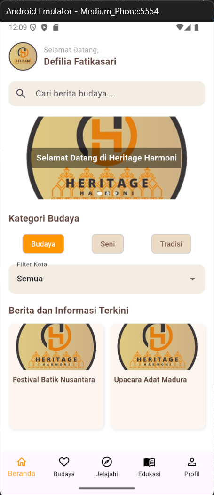
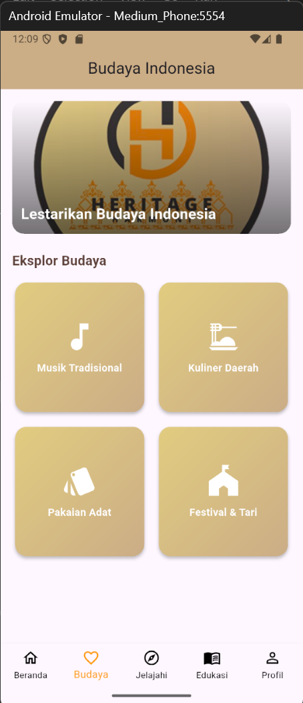
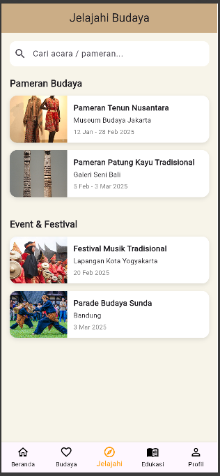
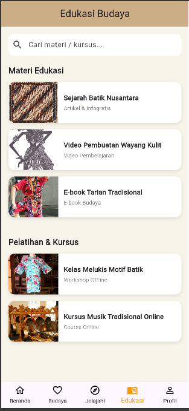
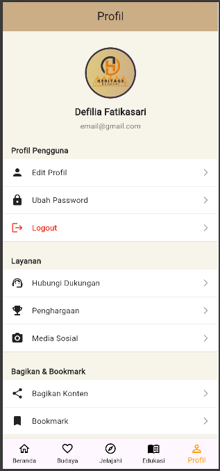

# HeritageHarmoni

HeritageHarmoni merupakan sebuah aplikasi mobile yang dirancang khusus untuk menjembatani kesenjangan dalam pelestarian budaya lokal di Indonesia. Aplikasi ini bertujuan untuk mengatasi tantangan yang dihadapi dalam melestarikan warisan budaya yang kaya dan beragam, sekaligus memastikan bahwa pengetahuan budaya tersebut tetap relevan dan dapat diakses oleh masyarakat luas.

## Konsep Utama dari HeritageHarmoni

Konsep utama dari HeritageHarmoni adalah untuk memberikan akses yang mudah dan luas terhadap berbagai informasi budaya, serta menyediakan alat yang mendukung dokumentasi dan promosi budaya secara efektif.

Dalam era digital yang serba cepat ini, penting untuk memiliki media yang tidak hanya menyimpan informasi tetapi juga mengedukasi masyarakat mengenai nilai-nilai budaya yang ada. Oleh karena itu HeritageHarmoni akan berfungsi sebagai pusat informasi yang komprehensif yang memungkinkan pengguna untuk mengeksplorasi dan memahami budaya lokal dari berbagai sudut pandang.

## Tampilan Halaman-Halaman HeritageHarmoni

**SplashScreen:**  

**Welcomepage:**  

**LoginPage:**
 

**RegisterPage:**
 

**ForgotPasswordPage:** 

**EmailSentPage:** 

**ResetPasswordPage:** 

**Homepage:**  

**Culturepage:**  

**Explorepage:**  

**Educationpage:**  

**Profilepage:**  

## Penjelasan HeritageHarmoni (PDF)

[Download PDF Penjelasan Aplikasi HeritageHarmoni](assets/pdf/penjelasan_aplikasi_heritageharmony.pdf)
