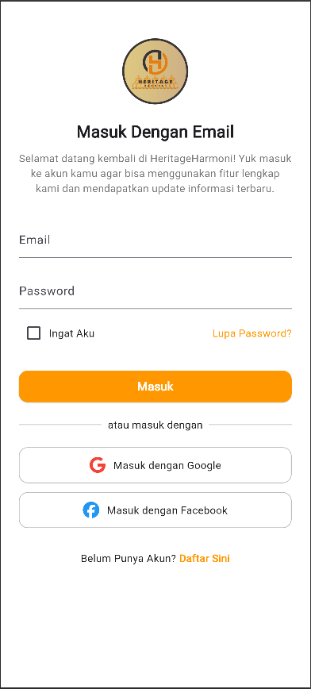
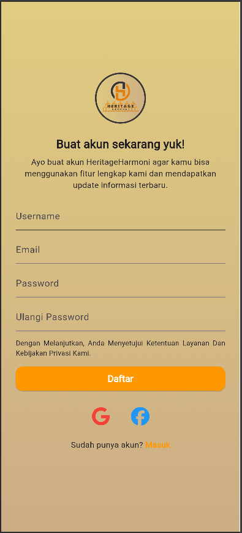
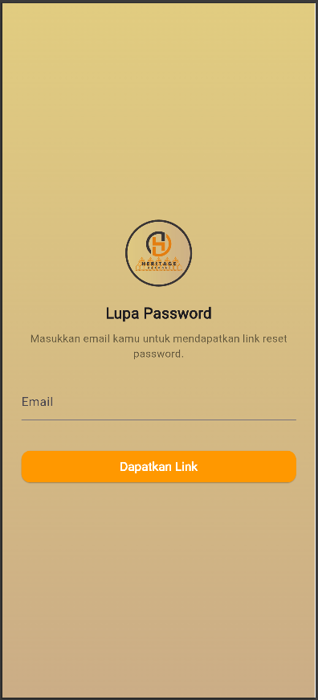
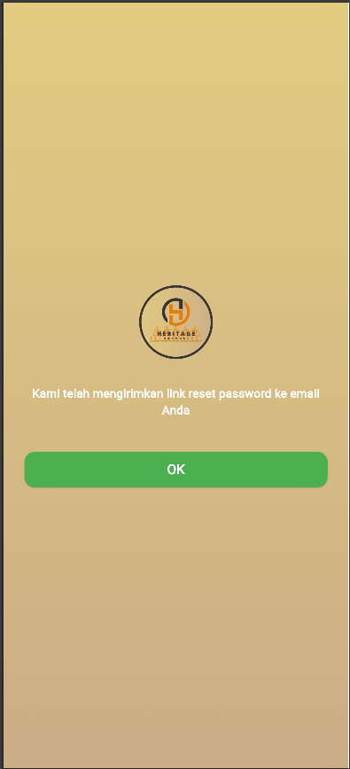
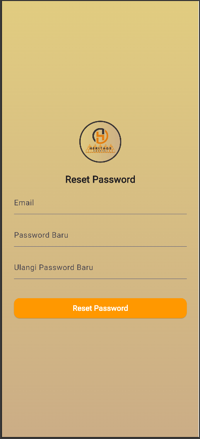
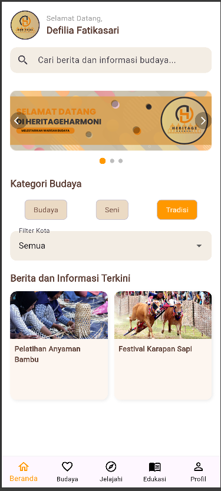
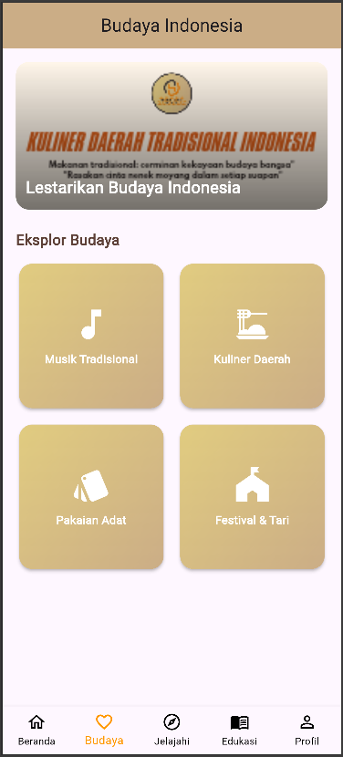
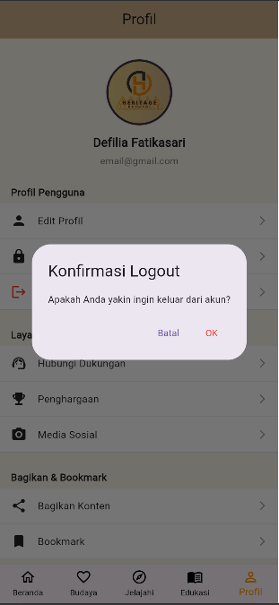

# 🏛️ HeritageHarmoni

**HeritageHarmoni** merupakan sebuah aplikasi mobile yang dirancang untuk menjembatani kesenjangan dalam pelestarian budaya lokal di Indonesia.  
Aplikasi ini bertujuan untuk mengatasi tantangan dalam menjaga dan mengembangkan warisan budaya yang kaya dan beragam, sekaligus memastikan bahwa pengetahuan budaya tersebut tetap relevan dan dapat diakses oleh masyarakat luas.

---

## 🎯 Konsep Utama HeritageHarmoni

HeritageHarmoni memberikan akses yang mudah terhadap berbagai informasi budaya, serta menyediakan alat untuk mendukung **dokumentasi dan promosi budaya** secara efektif.  
Di era digital yang serba cepat ini, penting untuk memiliki media yang tidak hanya menyimpan informasi tetapi juga **mengedukasi masyarakat mengenai nilai-nilai budaya lokal**.

Aplikasi ini berfungsi sebagai **pusat informasi budaya komprehensif**, yang memungkinkan pengguna untuk mengeksplorasi dan memahami budaya dari berbagai sudut pandang.

---

## 📱 Tampilan UI Design Halaman-Halaman HeritageHarmoni

### 🔹 Splash & Welcome

  
  

---

### 🔹 Autentikasi (Login, Register, Forgot Password)

  
  
  
  
  

---

### 🔹 Halaman Utama

  
  
  
  
  

---

### 🔹 Empat Menu di Halaman Budaya

  
  
  
  

---

### 🔹 Logout

  

---

## 📘 Penjelasan Aplikasi (PDF)

📄 [Klik di sini untuk mengunduh Penjelasan Aplikasi HeritageHarmoni (PDF)](assets/pdf/penjelasan_aplikasi_heritageharmony.pdf)
